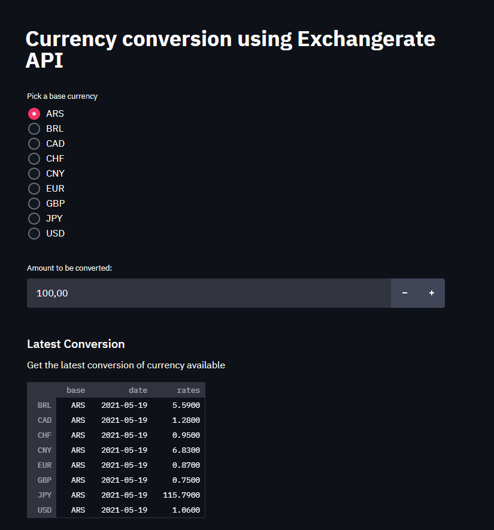
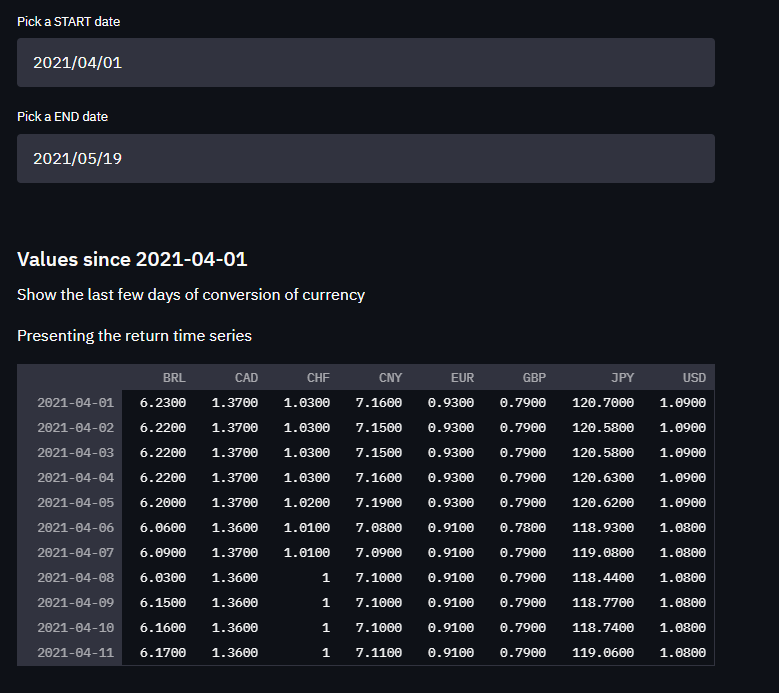
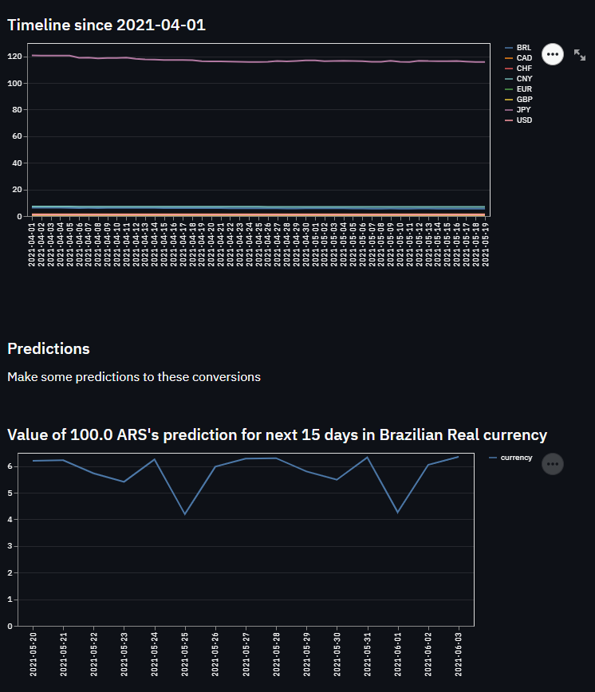

# Currency Convert Project with Streamlit
Provides a dynamic currency conversion with Streamlit.

To run the project, in terminal: `streamlit run main.py`

To install the compatible torch version, execute this pip command below:

`pip install torch==1.6.0+cpu torchvision==0.7.0+cpu -f https://download.pytorch.org/whl/torch_stable.html`

